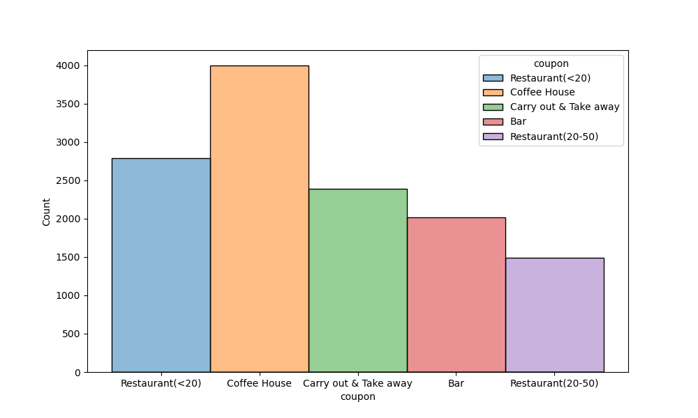
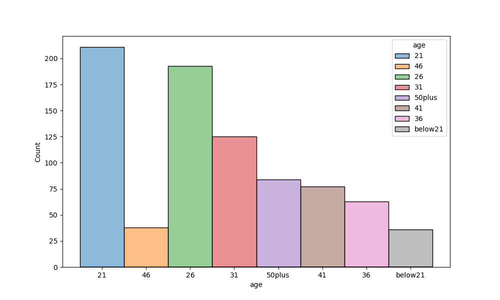
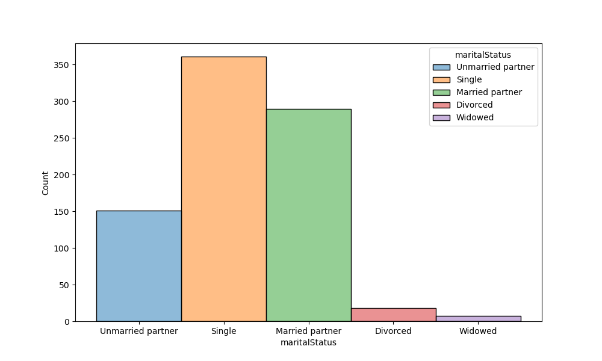
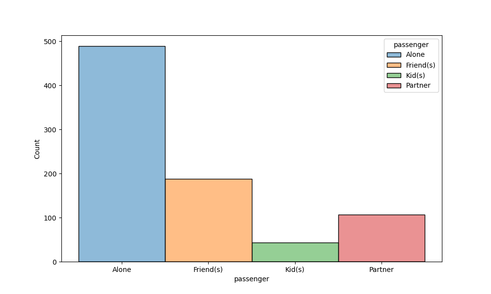
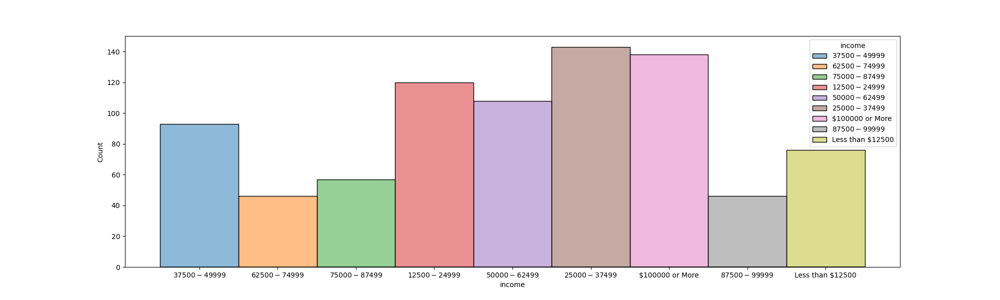
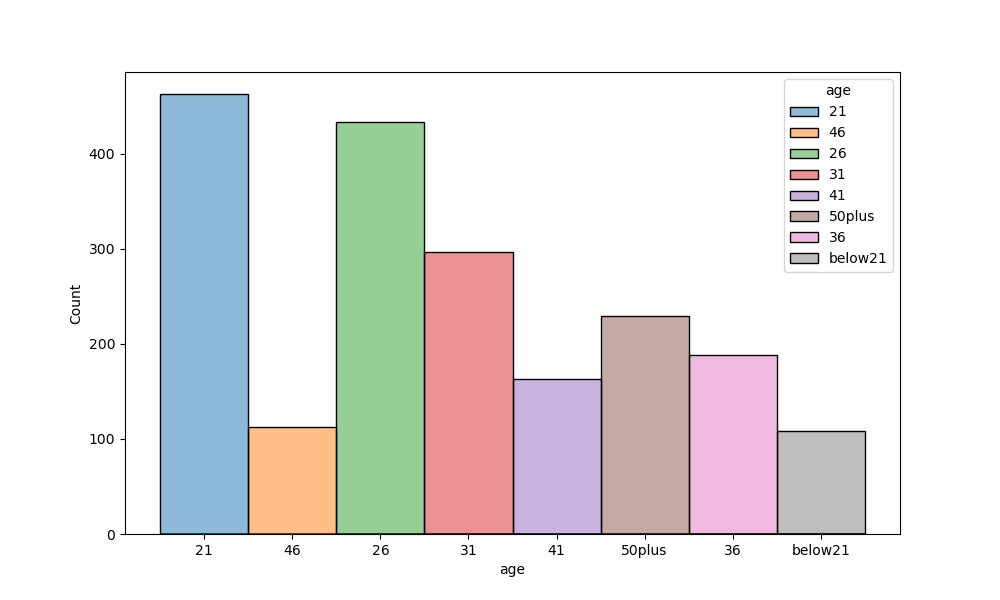
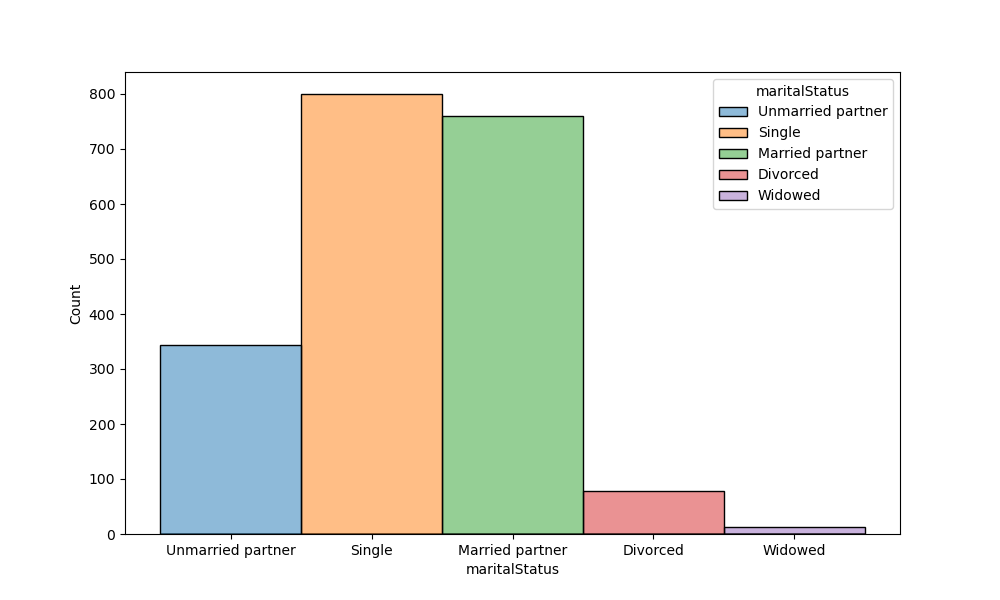
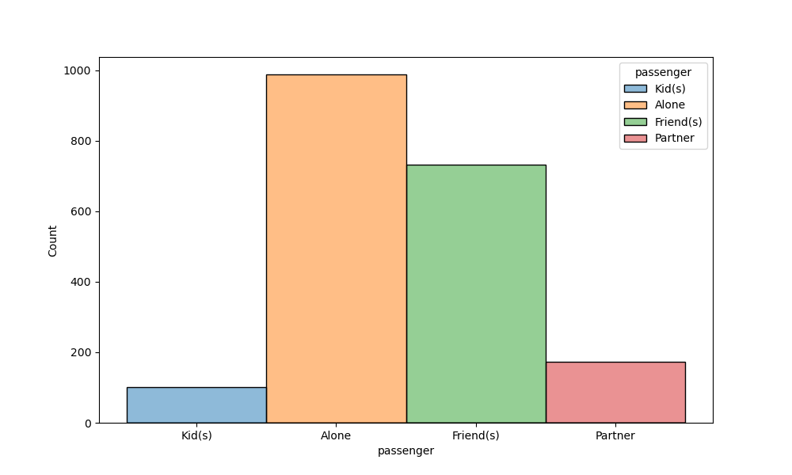

# Coupons ML

This is a summary of the exploratory [data analysis](coupons-ml.ipynb) performned on collected coupon acceptance data.

The scenario is of coupon offered to various types of drivers. The analysis tries to answer specific questions around what coupons are accepted or not based on various factors.

# Data

## Summary 

The data included various columns about the user and coupon type and the environment.

In total there where over 12,000 entries.

## Data Cleaning

While the data has some missing values that I was able to correct, the main deficiency is lots of data collected as categorical data when it could have been numeric, e.g., age, income, etc.

Specific cleaning steps to resolved null data in "CarryAway" column, renaming misspelled "passenger" column and removing redundant "car" column.

## Analysis on column "coupon"

By performing various slicing and query of the data would can perform analysis of the data on the column "coupon" and drawm some hytpothesis and conclusion that are logically sound.

### Coupon type: "Bar"

### Visualization

Let's graph the "Bar" accepted coupon with other dimenions: age, maritalStatus, passenger, and income

#### Results and observations

Investigating the coupon of type "Bar" to determine what factors drive acceptance of that coupon.

We could arrive to four hypothesis

1. Drivers unlikely to accept bar coupon when passenger is a kid
2. Drivers who are Farmers Fisherman or Forestry profession are unlikely to accept a Bar coupon
3. Drivers likely to accept bar coupon if already going to bar often
4. Drivers more likely to accept bar coupon if age 25+

### Coupon type: "Coffee House"

### Visualization

Let's graph the "Coffee House" accepted coupon with other dimenions: age, maritalStatus, and passenger

#### Results and observations

Doing a similar analysis on coupon type: Coffee House we could also derive a set of conclusions.

From the analysis we can infer the following:

1. being Alone in car seems to be determinent to accepting Coffee House Coupon since being Married or not results same
2. when Married with Kids there is low acceptance
3. when Unmarried acceptance is low no matter the passenger
4. being divorced or widowed there is low acceptance

# Next steps

Since the data includes lots of data that could be numerical vs categorical, we are missing the ability to create pair-wise scatter plot that could give some idea on coocurrence and trends. So a good next steps would be to convert that data.

Second, peform the same analysis as above on the remaining coupon types. Use the covariant matrix to infer columns that are correlated and use that to drive the analysis on coupon types.
